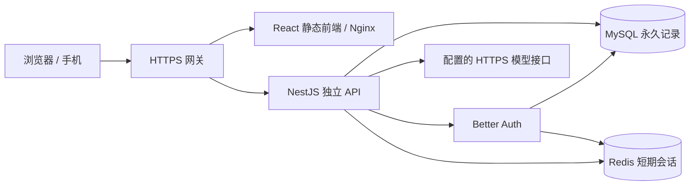

# 架构与选型记录

研究日期：2026-10-02。通过 GitHub 实际读取仓库、README、提交、发布与关键源代码。活跃维护与代码适合业务是两项不同指标。

| 方案 | 维护证据 | 可复用内容 | MySQL / Redis 与部署 | 结论 |
|---|---|---|---|---|
| [brocoders/nestjs-boilerplate](https://github.com/brocoders/nestjs-boilerplate) + [extensive-react-boilerplate](https://github.com/brocoders/extensive-react-boilerplate) | 默认分支实质更新分别为 2026-08-08 / 08-09；近期依赖 PR 的 API / E2E CI 成功；MIT | Nest 模块、服务与持久化边界、DTO/API、用户管理、认证流程、CI；React 的 API 服务、查询缓存与功能划分 | 后端默认 PostgreSQL；文档支持 MySQL。Redis 与本项目的数据权限需补充。配套前端使用 Next.js 16 | 最贴近业务的架构参考；直接搬运默认 JWT / JS 可读令牌不能满足本项目的即时撤销与会话保护要求 |
| [dromara/RuoYi-Vue-Plus](https://github.com/dromara/RuoYi-Vue-Plus) | 6.X 分支；最后 push 2026-09-28；README 6.0.0；MIT | Sa-Token、RBAC、MyBatis-Plus、审计、用户与管理后台 | 原生 MySQL + Redis/Redisson；Spring Boot 4.1 / JDK 21 或 25；官方 Vue 前端是 [CrazyLionCat/plus-ui](https://github.com/CrazyLionCat/plus-ui) | 国内企业后台很成熟，但部门、租户、流程等模块增加本项目学习、运维与攻击面；占卜公众前端仍需开发 |
| [strapi/strapi](https://github.com/strapi/strapi) | v5.56.0 于 2026-09-30 发布，10-02 有人工修复 | 内容模型、API、管理后台、权限 | 支持 MySQL；Redis 业务限流、每日唯一抽取、AI 预算仍需定制；没有官方 Docker 镜像 | 适合内容运营优先的网站。本项目核心是事务与个人数据，单独内容后台收益较小；社区 MIT，ee 目录商业许可 |

补充检查：[FastAPI 官方全栈模板](https://github.com/fastapi/full-stack-fastapi-template) 0.12.0，React + FastAPI + PostgreSQL，包含账户、数据库与测试；当前默认构建将前端复制进后端镜像。独立部署、MySQL 和 Redis 均需调整，因此没有作为前三中的首选。另参考 [Bulletproof React](https://github.com/alan2207/bulletproof-react) 的功能边界；它是结构指南，不是现成后端。

## 采用方案

基于成熟框架重建业务模块，复用已验证的占卜引擎。不是原封不动 fork 一个企业后台。具体依赖：NestJS 11、React 19、Vite、TanStack Query、Prisma 6、MySQL 8.4、Redis 7.4、[Better Auth](https://github.com/better-auth/better-auth) 1.7.7（2026-09-30 稳定版，MIT）。

Better Auth 原生负责安全散列、HttpOnly 会话 cookie、邮箱验证、重设密码、TOTP 与恢复码；采用官方 Redis storage 与 Prisma MySQL adapter。没有从头写密码认证或 JWT 刷新流程。Prisma 采用当前锁定的 6.19.0 兼容版本，不使用 8.0 RC；后续升级应单独测试迁移。

React/Vite 的静态前端不依赖 SSR、Google 字体/CDN或第三方登录，便于国内部署和维护。本项目保留简洁公众网站；管理页面使用同一个前端应用下的独立功能模块，服务端始终验证角色。

## 边界与关键约束

- 前端只通过 HTTP 请求后端，不直接访问数据库、Redis或模型密钥；两个镜像可独立构建、部署、更新。同域反向代理只简化 cookie/CORS，并未把代码或运行时打包成一个 Worker。
- 后端 Public、Oracle、Administration 与 Security 模块分别处理公开状态、个人业务、管理员业务和权限；controller 校验输入，service 执行业务与事务，Prisma 负责参数化持久化。
- MySQL 唯一约束保障用户每日一次领取；版本号保障日记并发更新不静默覆盖。每日日期统一 Asia/Shanghai，不允许用户改时区绕过。
- Redis 是短期会话、共享限流和有到期时间的并发租约；永久记录、预算与唯一性以 MySQL 为准。安全服务异常时拒绝请求。
- 问题、日记与 AI 解读用 AES-256-GCM 加密，并绑定用户、记录和字段作为 AAD；认证库自己的秘密由 AUTH_SECRET 保护。这是应用层加密，服务端持钥，不是端到端加密。
- 匿名访客仅本机临时体验，无自动上传；登录后服务端生成牌面或六爻，客户端不能伪造已生成结果。旧版本浏览器记录保留于旧站点，不自动上传私人内容。
- AI 只加载本人记录与固定证据；明确同意后调用。无数据库、工具或其他用户读取能力。生成受输出格式、引用范围、超时、响应体大小、并发与持久日预算约束。
- 管理后台只读取基本用户信息、汇总统计、审计与主动共享的占卜；没有私人日记或未共享问题的管理接口。角色只能由服务器维护命令提升，正式环境管理员要求 TOTP。
