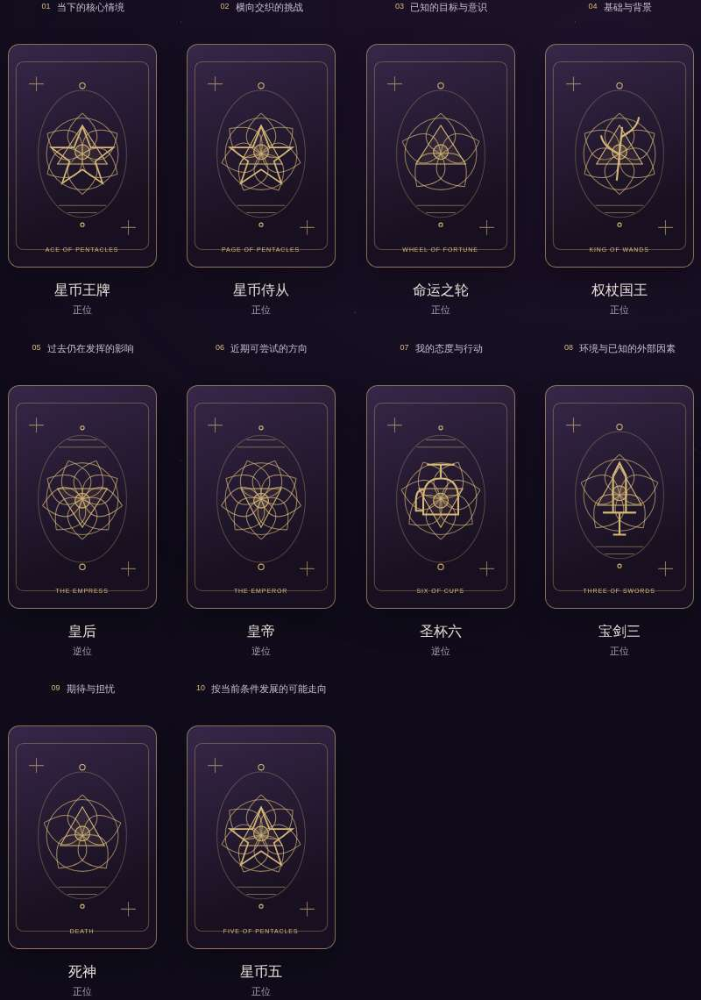
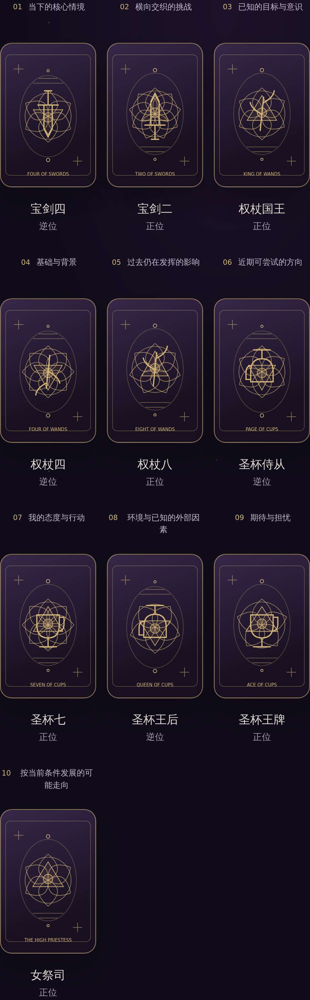
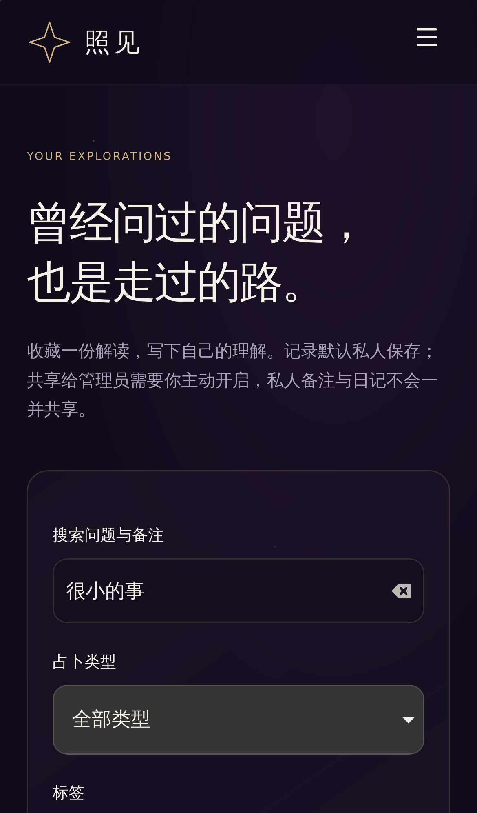
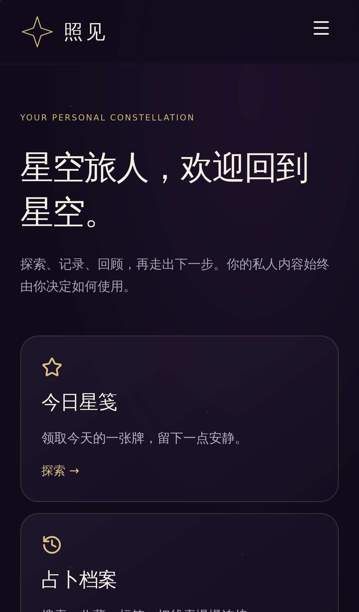

# 全面功能版：实际界面与验证

本页图片来自隔离测试账户运行网站时的浏览器截图。代码提交：`54f073bad4d53ea92cdb944b3357b9250f3b4afb`。这些是已实现界面，当前 GPT 线上站点仍为旧原型，新版尚未部署。

[代码 review：PR #4](https://github.com/9theresa9/star-oracle/pull/4) · [完整 CI 验证](https://github.com/9theresa9/star-oracle/actions/runs/37091695026)

## 验证结果

- 26 项占卜领域测试、21 项后端集成测试通过。
- 24 项浏览器用例通过，覆盖桌面 Chromium、iPhone 尺寸 WebKit 和 320px Chromium。3 项有意跳过的用例属于管理员/PWA 的重复设备覆盖；管理员在桌面和 iPhone 验证，PWA 有独立验证。
- 前后端类型检查与构建通过，数据库迁移无 schema 差异；完整及运行时依赖扫描均为 0 个已知漏洞。
- Docker 前后端独立镜像验证、应用数据库账号禁止 DDL、HTTPS 和 age 加密备份恢复通过。
- 手机输入与导航检查无自动放大、横向偏移或溢出；个人截图校验位于页面顶部。
- AI 合同使用隔离 HTTPS 测试服务；真实模型密钥、邮件服务及部署服务器仍需配置。现金支付未接入。

## 实际界面

下列为视口截图。完整页面 PNG、浏览器 trace 及测试报告可在 CI 的 production-review artifact 中下载（保留 14 天）。测试使用 WebKit 的 iPhone 参数，不代表已经在实体 iPhone 上验收。

| 页面 | 桌面 Chromium | iPhone WebKit |
| --- | --- | --- |
| 首页 |  |  |
| 凯尔特十字 |  |  |
| 私人记录 |  |  |
| 个人空间 |  |  |

## 本轮范围

32 种塔罗牌阵、15 个主题、3 种易经起卦与互/错/综卦；78 牌/64 卦图鉴、10 篇教程；AI 追问和主动授权的周/月回顾；搜索收藏标签、私人日记日历、行动计划、PNG 海报、数据导出；公告反馈、后台汇总、会员每日额度、兑换码及积分账本。

数字与时间起卦使用公开标注的当代简化规则；时间使用公历。本 PR 基于未合并的架构 PR #3，未自动改主分支。
